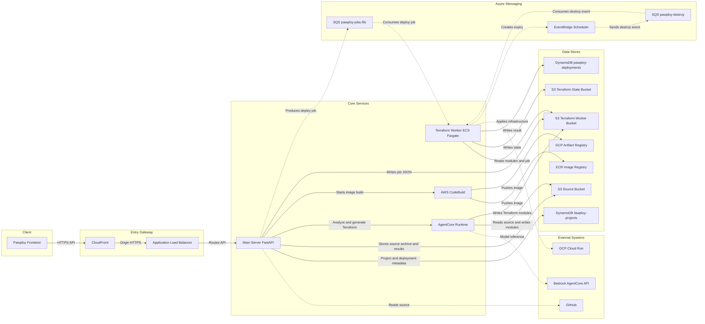
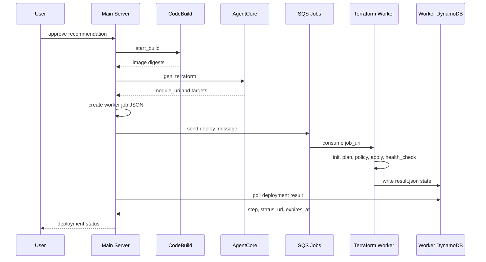

# Pawploy 시스템 아키텍처

이 문서는 Pawploy의 전체 배포 흐름을 Main Server를 중심으로 설명한다. 사용자가 GitHub 저장소를 등록하면 Main Server가 소스 보관, AI 분석, 이미지 빌드, Terraform 생성, 인프라 배포 상태 조회를 연결한다.

## 1. 전체 구조



## 2. Main Server의 역할

Main Server는 사용자 요청과 비동기 배포 시스템 사이의 오케스트레이터다.

### 요청 진입

- Frontend는 CloudFront와 ALB를 통해 Main Server API를 호출한다.
- 프로젝트별 토큰은 `X-Project-Token` 헤더로 전달한다.
- Main Server는 프로젝트 메타데이터와 작업 상태를 DynamoDB에 저장한다.

### 소스 등록과 분석

1. GitHub 저장소 주소와 ref를 검증한다.
2. GitHub에서 특정 commit의 소스를 tar.gz로 내려받아 Source S3 Bucket에 저장한다.
3. `POST /api/v1/projects/{id}/analyses` 요청이 오면 AgentCore Runtime을 호출한다.
4. 분석 결과와 `recommendation`, `build_files`, 경고 정보를 Source S3에 저장한다.
5. Frontend는 분석 상태를 polling하며 분석 결과를 표시한다.

### 이미지 빌드

사용자가 추천 아키텍처를 승인하면 Main Server는 CodeBuild를 시작한다.

- `SOURCE_URI`: GitHub commit archive 위치
- `BUILD_FILES_URI`: AgentCore가 생성한 Dockerfile/buildspec 위치
- `IMAGE_TAG`: 프로젝트와 commit 기반 태그

CodeBuild는 소스를 받아 Docker 이미지를 빌드하고 다음 레지스트리에 digest 기준으로 push한다.

- AWS: ECR `pawploy-apps`
- GCP: Artifact Registry `pawploy-apps`

Main Server는 CodeBuild의 exported environment variables에서 양쪽 이미지 URI를 읽는다. 이미지 빌드가 완료되기 전에는 Terraform 배포를 시작하지 않는다.

## 3. Terraform 배포 흐름



### AgentCore Terraform 생성

Main Server는 승인된 recommendation과 이미지 digest를 AgentCore의 `gen_terraform` 모드로 전달한다.

AgentCore 응답은 다음 정보를 포함한다.

- 전체 `status`
- 클라우드별 `targets`
- 클라우드별 `architecture`
- 클라우드별 Terraform `module_uri`

Main Server는 응답 전체를 Source S3에 보관하지만, Worker job에는 전체 응답 URI가 아니라 선택된 클라우드의 모듈 디렉터리인 `targets[].module_uri`를 전달한다.

### Worker job

Main Server는 Terraform Worker가 읽을 작업 JSON을 다음 경로에 저장한다.

```text
s3://pawploy-tf-135808950984-ap-northeast-2/jobs/<worker_deploy_id>/<request_id>.json
```

SQS에는 파일 내용 전체가 아니라 다음 메시지만 보낸다.

```json
{
  "action": "deploy",
  "job_uri": "s3://pawploy-tf-135808950984-ap-northeast-2/jobs/<worker_deploy_id>/<request_id>.json"
}
```

FIFO 큐의 `MessageGroupId`는 배포 ID다. 따라서 같은 배포에 대한 재시도와 수정 요청은 순서대로 처리된다.

## 4. 상태 모델

### Main Server가 관리하는 상위 상태

| 단계 | 의미 |
| --- | --- |
| `build` | CodeBuild가 Docker 이미지를 빌드하는 중 |
| `terraform` | AgentCore가 Terraform 모듈을 생성하거나 Worker job을 준비하는 중 |
| `plan` | Terraform plan 실행 중 |
| `policy` | 정책 검사 중 |
| `apply` | 클라우드 리소스 생성 중 |
| `health` | 배포된 앱의 헬스체크 중 |

### Terraform Worker의 상세 상태

Worker는 클라우드별 target 상태를 DynamoDB `pawploy-deployments`에 기록한다.

```text
preparing → generating → init → plan → apply → health_check → running
```

실패 시 각 target에 `failed_stage`, `error`, `log_tail`, `current_state`를 기록한다. Main Server는 이를 API 응답의 `step`, `reason`, `url`, `expires_at`으로 매핑한다.

배포 결과에 `url`이 있으면 최종 `status`가 아직 `deploying`이어도 접속 가능한 배포로 판단한다. Frontend는 이 시점에 성공 화면으로 전환하고 polling을 종료한다.

## 5. 자동 만료와 삭제

Terraform Worker job의 기본 TTL은 60분이며 최대값도 60분이다.

Worker가 Terraform 모듈을 적용할 때 AWS 배포에는 만료 시각을 기준으로 EventBridge Scheduler를 만든다.

1. Scheduler가 `expires_at` 시각에 도달한다.
2. `pawploy-destroy` SQS에 `destroy` 메시지를 전송한다.
3. Terraform Worker가 해당 배포의 state를 읽고 리소스를 삭제한다.
4. Scheduler는 실행 후 자동으로 삭제된다.

GCP 배포도 Worker의 결과와 만료 정보를 기준으로 정리 대상에 포함되며, Worker의 sweep/orphan 검사로 보완된다.

## 6. 장애 복구와 재시도

- Frontend가 polling 중 중단되어도 배포 상태는 DynamoDB에 남는다.
- Main Server는 CodeBuild 성공 후 Terraform 상태가 비어 있으면 상태 조회를 계기로 `gen_terraform`을 다시 호출한다.
- Worker job이 큐에 들어간 뒤에는 Worker DynamoDB 결과를 기준으로 현재 단계를 복구한다.
- FIFO 큐의 동일 `MessageGroupId`로 배포별 작업 순서를 보장한다.
- Worker는 처리되지 않은 예외나 destroy 실패를 SQS 재시도 대상으로 남긴다.
- Terraform 실패 시 Worker는 실패 단계와 로그 tail을 저장해 AgentCore 수정 요청에 사용할 수 있다.

## 7. 권한 경계

### Main Server IAM

- Source S3 프로젝트 경로 읽기/쓰기
- `bedrock-agentcore:InvokeAgentRuntime`
- CodeBuild 시작 및 상태 조회
- Worker artifact S3의 `jobs/*` 쓰기
- `pawploy-jobs.fifo` 메시지 전송
- Worker 결과 테이블 `pawploy-deployments` 읽기

### Terraform Worker IAM

- Worker artifact와 AgentCore module S3 읽기
- Terraform state S3 읽기/쓰기
- Worker 결과 DynamoDB 쓰기
- 배포 대상 AWS 리소스 생성·조회·삭제
- 만료 Scheduler 생성 및 destroy 큐 전송

Main Server는 직접 Terraform을 실행하지 않는다. Terraform 실행과 클라우드 리소스 변경 권한은 Terraform Worker에 분리되어 있다.

## 8. 핵심 설계 원칙

1. 이미지와 Terraform 모듈은 모두 URI와 digest로 연결해 재현 가능한 배포를 만든다.
2. Main Server는 오케스트레이션과 API 상태 제공을 담당하고, 실제 인프라 변경은 Worker가 담당한다.
3. 상태의 원본은 Main Server의 프로젝트 상태와 Worker의 상세 결과로 분리한다.
4. Frontend는 `status`만 보지 않고 `url`과 상세 `step`을 함께 사용한다.
5. 자동 만료를 기본값으로 둬 테스트 배포가 리소스를 무기한 점유하지 않도록 한다.
