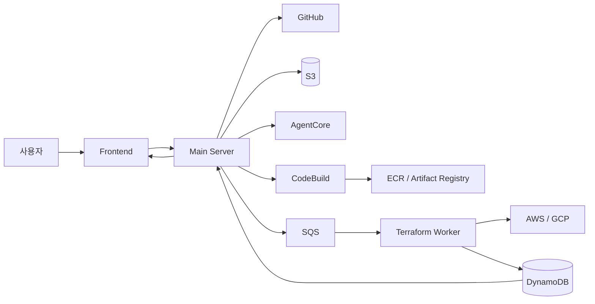

# Pawploy 시스템 배포 흐름 발표 대본

안녕하세요. 지금부터 Pawploy에서 사용자가 GitHub URL을 입력한 순간부터 실제 서비스가 배포되는 과정까지를 간단히 설명드리겠습니다.

## 발표 대본

### 1. GitHub 저장소 등록

사용자는 먼저 Pawploy Frontend에서 프로젝트를 만들고 GitHub 저장소 주소를 입력합니다. Frontend는 이 요청을 Main Server로 전달합니다.

### 2. 소스 버전 고정 및 보관

Main Server는 저장소와 branch를 확인한 뒤, 실제 commit을 하나로 확정합니다. 그리고 그 commit의 소스 코드를 S3에 압축본으로 저장하고, 프로젝트와 작업 상태는 DynamoDB에 기록합니다. 이렇게 하면 이후 분석과 배포가 항상 동일한 코드 버전을 기준으로 진행됩니다.

### 3. AgentCore 분석 및 추천

다음으로 Main Server는 AgentCore를 호출합니다. AgentCore는 소스 코드를 분석해서 어떤 클라우드와 아키텍처가 적합한지 판단하고, 비용과 권한, 주의사항을 함께 제안합니다. 또한 이미지 빌드에 필요한 Dockerfile과 buildspec을 생성합니다. 분석 결과와 생성 파일은 S3에 보관되고, 사용자는 화면에서 추천안을 확인한 뒤 승인하거나 채팅으로 수정 요청을 보낼 수 있습니다.

### 4. 승인과 병렬인 사전 빌드

Main Server는 사용자 검토와 병렬로 AWS CodeBuild를 시작합니다. CodeBuild는 S3에서 원본 코드와 AgentCore가 만든 Dockerfile, buildspec을 가져와 Docker 이미지를 빌드합니다. 완성된 이미지는 AWS 배포용 ECR 또는 GCP 배포용 Artifact Registry에 저장되며, 실제 배포에는 이미지 태그가 아니라 고정된 digest를 사용합니다. 빌드가 실패하면 `fix_build`로 수정하고 최대 3회까지 재시도합니다.

### 5. 사용자 검토

Frontend는 AgentCore의 추천안과 이유, 예상 비용, 필요한 권한을 사용자에게 보여줍니다. 사용자는 AWS 또는 GCP 중 하나를 선택해 승인하거나 수정 요청을 보낼 수 있습니다. 수정 요청이면 분석 단계부터 다시 진행됩니다.

### 6. Terraform 생성

사용자가 배포 대상을 승인하고 이미지 빌드가 끝나면 Main Server는 AgentCore의 `gen_terraform`을 호출합니다. AgentCore는 승인된 클라우드와 이미지 digest를 기준으로 Terraform 모듈을 만들고 S3에 저장합니다. Main Server는 배포 작업 JSON을 S3에 저장한 뒤, SQS에는 작업 위치만 전달합니다.

### 7. 검증 및 apply

SQS 메시지를 받은 Terraform Worker가 실제 인프라 배포를 담당합니다. Worker는 S3에서 작업과 Terraform 모듈을 가져와 IaC 검사, Terraform 초기화, plan 정책 검사, apply, 헬스체크 순서로 실행합니다. AWS라면 EC2나 Lambda를 만들고, GCP라면 Cloud Run을 만듭니다. Main Server는 Terraform을 직접 실행하지 않고 Worker에 작업을 위임합니다.

### 8. 결과 확인 및 자동 삭제

Worker가 진행 상황과 결과를 DynamoDB에 기록하면 Main Server가 이를 조회해 Frontend에 전달합니다. Frontend는 단계와 상태를 보여주고, 접속 URL이 확인되면 성공 화면으로 전환하면서 polling을 멈춥니다. 또한 배포 시 만료 시각을 등록해, 시간이 되면 EventBridge Scheduler가 destroy 큐로 삭제 작업을 보냅니다. 사용자가 직접 “지금 종료”를 눌러도 같은 삭제 흐름을 사용합니다.

정리하면, Pawploy에서 Main Server는 GitHub, S3, AgentCore, CodeBuild, SQS, DynamoDB를 연결하는 오케스트레이터입니다. 분석은 AgentCore가, 이미지 빌드는 CodeBuild가, 실제 인프라 생성과 삭제는 Terraform Worker가 담당합니다. 각 역할을 분리했기 때문에 사용자는 GitHub URL과 간단한 승인만으로 재현 가능하고 안전한 클라우드 배포를 진행할 수 있습니다.
