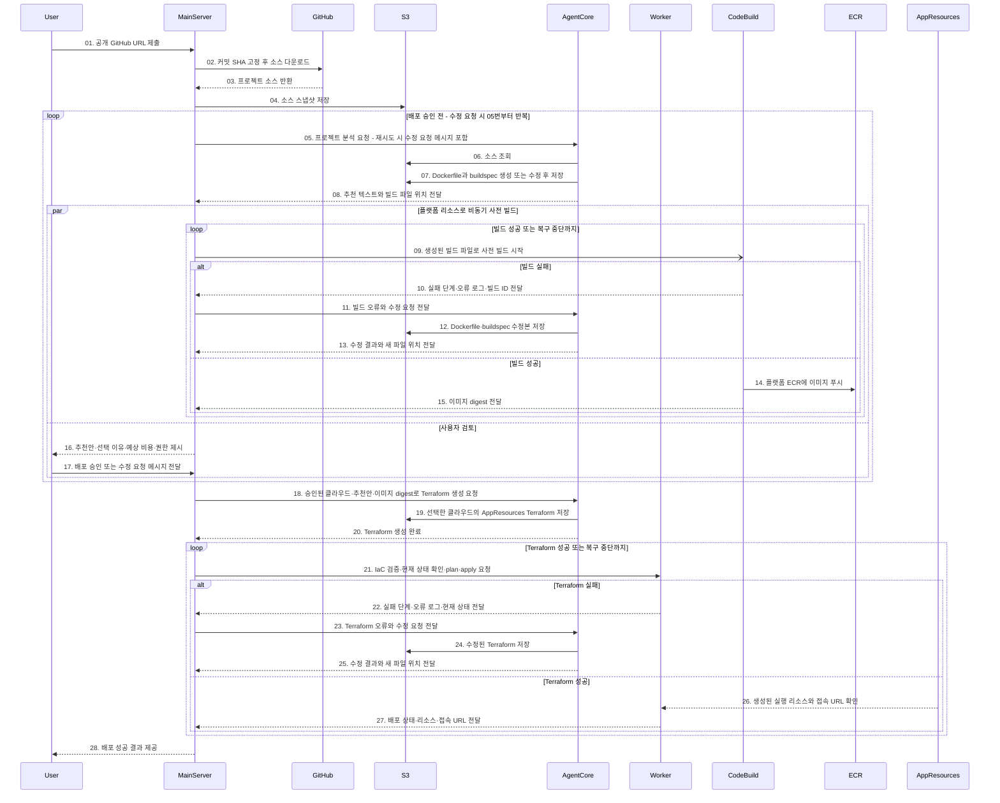

# AI 기반 GitHub 프로젝트 배포 시퀀스 다이어그램

참여자별 세로 생명선을 따라 요청과 응답을 시간순으로 나타낸 시퀀스 다이어그램이다. 아래는 컨테이너 이미지가 필요한 프로젝트의 목표 흐름이며, 실제 구현 상태를 나타내지 않는다. **플랫폼 리소스**는 메인 서버·워커·S3·ECR·CodeBuild·AgentCore 에이전트처럼 플랫폼이 배포 요청을 받기 전에 미리 준비·운영하는 기반이다. **AppResources**는 추천 결과에 따라 AWS 또는 GCP에 동적으로 생성하는 실행 리소스다. 두 종류 모두 사용자 계정이 아닌 플랫폼의 계정과 비용으로 운영한다. AppResources의 격리·배포 단위는 아직 미정이다.

06번 소스 조회 직후 07번에서 **Dockerfile과 buildspec을 함께 생성**한다. 08번에서는 클라우드·아키텍처·리소스 추천 텍스트와 두 빌드 파일의 위치를 메인 서버에 전달한다. 플랫폼 CodeBuild는 **사용자 승인과 병렬로** 이미지를 빌드한다. 빌드가 실패하면 메인 서버가 오류 로그를 AgentCore에 전달하고, AgentCore가 Dockerfile·buildspec을 고친 뒤 메인 서버가 다시 빌드한다. 17번에서 사용자가 수정 요청을 하면 해당 메시지를 포함해 05번부터 다시 분석하며, 이전 이미지와 빌드 결과는 사용하지 않는다. 승인하면 해당 반복의 이미지 digest와 선택한 클라우드를 기준으로 AppResources용 Terraform을 만들고 배포한다. Terraform 검증·적용이 실패해도 워커가 오류와 현재 상태를 메인 서버로 보내고, AgentCore가 IaC를 수정한 후 워커가 다시 검증·계획·적용한다.

위 시퀀스는 자동 복구에 성공한 경우의 경로다. 자동 복구에는 횟수와 시간의 상한을 두고, 복구 불가 시 후속 단계로 진행하지 않고 실패 원인과 필요한 사용자 조치를 전달한다. 소스 코드 자체의 수정이 필요하거나, 수정 결과가 사용자가 승인한 아키텍처·비용·권한 범위를 벗어나면 자동 적용을 멈추고 사용자에게 확인한다. Terraform `apply` 실패 후에는 이미 생성된 리소스가 남을 수 있으므로 현재 리소스와 state를 확인하고 새 `plan`을 계산한 뒤 재시도한다. [Terraform의 apply 오류 처리](https://developer.hashicorp.com/terraform/tutorials/cli/apply) 정적 웹처럼 컨테이너 이미지가 필요 없는 프로젝트는 Dockerfile과 ECR 단계를 생략한다.

## 역할과 경계

- **메인 서버**는 플랫폼 리소스로서 요청을 접수하고 배포 작업을 추적한다. 로컬 파일시스템을 영구 소스 저장소로 사용하지 않는다.
- **AgentCore 에이전트**는 소스 분석 직후 컨테이너 프로젝트의 Dockerfile과 `buildspec`을 생성하고, 클라우드·아키텍처·리소스를 텍스트로 추천한다. 배포 승인 후 선택한 클라우드의 AppResources용 Terraform을 생성한다. 생성 파일을 S3에 저장하는 동작은 우리가 구현해야 한다.
- **플랫폼 S3·빌더·ECR**은 플랫폼이 사전에 준비·운영하는 기반이다. 사용자별 소스·산출물·이미지는 논리적으로 분리한다. 미승인 코드의 빌드 비용과 이미지 보관 비용은 플랫폼이 부담한다. 빌드는 격리하고 권한을 최소화하며, 수정으로 무효화된 이미지는 정리한다.
- **배포 워커**도 사전에 준비한 플랫폼 리소스다. 17번의 사용자 배포 승인 이후 생성 코드를 검증하고 `terraform plan`을 실행한다. 승인 범위와 검증 결과가 일치하면 추가 승인 없이 동적으로 결정된 AppResources에 Terraform을 적용한다. 실패 시에는 메인 서버에 오류와 현재 상태를 전달한다.
- **AppResources**는 AWS 또는 GCP의 플랫폼 소유 계정·프로젝트에서 생성하며, 비용도 플랫폼이 부담한다. 사용자별·앱별·환경별로 어떤 경계에서 격리하고 Terraform state를 나눌지는 아직 결정하지 않았다.
- **S3의 IaC 산출물과 Terraform state는 별개**다. state는 원격 백엔드에 보관하고 잠금을 설정하되, 구체적인 분리 단위는 추후 설계한다.
- **배포 대상**은 선택한 클라우드와 프로젝트 특성에 따라 결정한다. 모든 프로젝트에 ECR이나 CodeBuild 컨테이너 빌드가 필요한 것은 아니다. GCP 실행 리소스가 플랫폼 ECR의 이미지를 어떻게 사용할지도 별도로 결정해야 한다.
- **정보가 부족하거나 위험한 설정**(환경 변수, 포트, 데이터베이스, 과도한 권한 등)은 에이전트가 임의로 확정하지 않고 사용자에게 확인한다.

> Terraform 코드 생성과 검증이 곧 배포 성공을 보장하지는 않는다. 빌드 실패·권한 오류·런타임 오류는 작업 ID별 상태와 로그로 추적해야 한다.
